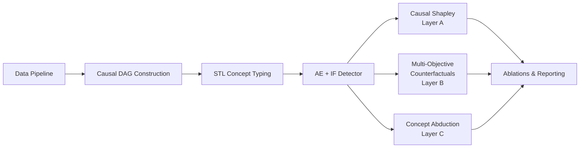

# NF-DAG-NIDS

**Causal Explainable AI for Autoencoder-Based Network Intrusion Detection**


An unsupervised NIDS (Autoencoder + Isolation Forest ensemble) over NetFlow-v2 traffic,
paired with a causal explainability stack: a validated causal DAG over flow features, Shapley
attributions computed *through* that DAG, multi-objective counterfactual explanations, and
concept-level abduction — so a detection doesn't just fire, it tells you *why*, in terms an
analyst can act on.

## Pipeline



| Stage | Notebook | Package |
|---|---|---|
| Data Pipeline | `01_data_pipeline.ipynb` | `caushap_nids.data_pipeline` |
| Causal DAG Construction | `02_dag_construction.ipynb` | `caushap_nids.dag` |
| STL Concept Typing | `03_stl_typing.ipynb` | `caushap_nids.stl` |
| Causal Shapley (Layer A) | `04_layer_a_causal_shapley.ipynb` | `caushap_nids.xai_layers.causal_shapley` |
| Multi-Objective CFs (Layer B) | `05_layer_b_multi_obj_cf.ipynb` | `caushap_nids.xai_layers.multi_obj_cf` |
| Concept Abduction (Layer C) | `06_layer_c_concept_abduction.ipynb` | `caushap_nids.xai_layers.concept_abduction` |
| Ablation Experiments | `07_ablation_runs.ipynb` | `caushap_nids.experiments`, `caushap_nids.models` |
| Results & Reporting | `08_results_tables.ipynb` | `caushap_nids.evaluation`, `caushap_nids.reporting` |

> This repository is being populated incrementally — one notebook and its supporting code per commit —
> so history mirrors how the project was actually built.

## Getting started

```bash
# install dependencies (uv recommended)
uv sync --all-extras

# or with pip
pip install -e ".[dev]"

# run the test suite
uv run pytest

# run an experiment
uv run caushap-run --config configs/A4_full.yaml
```

## Datasets

Built on NetFlow-v2 variants of four public IDS datasets — NF-CSE-CIC-IDS2018-V2, NF-UNSW-NB15-v2,
5G-NIDD, and Edge-IIoTset. Raw data is not tracked in this repository (see `.gitignore`); place the
parquet files under `data/` locally to reproduce the notebooks.

## Project layout

```
src/caushap_nids/
├── data_pipeline/    # loaders, temporal/stratified splits, windowing
├── dag/              # causal DAG construction, validation, sensitivity
├── stl/               # signal temporal logic concept typing
├── xai_layers/
│   ├── causal_shapley/    # DAG-aware Shapley attribution
│   ├── multi_obj_cf/      # NSGA-II multi-objective counterfactuals
│   └── concept_abduction/ # concept-level abductive explanations
├── models/            # autoencoder, isolation forest, ensembling
├── experiments/        # ablation runner, CLI, seed management
└── evaluation/, reporting/  # metrics, tables, narrative reports
```
